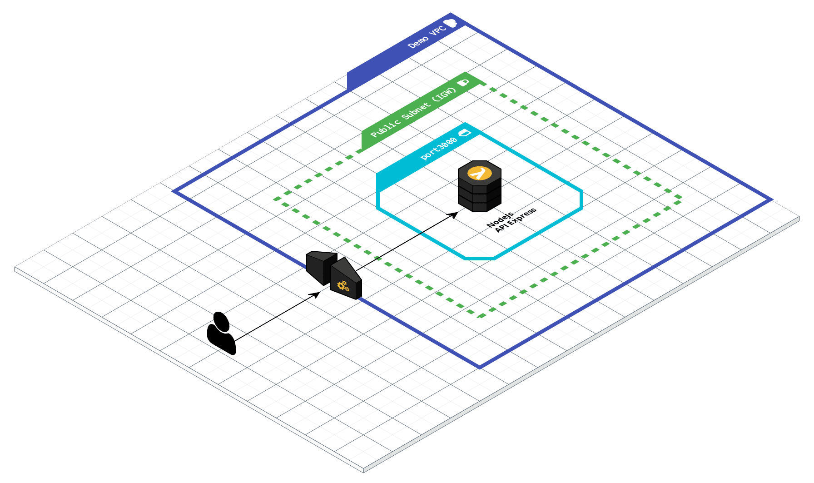
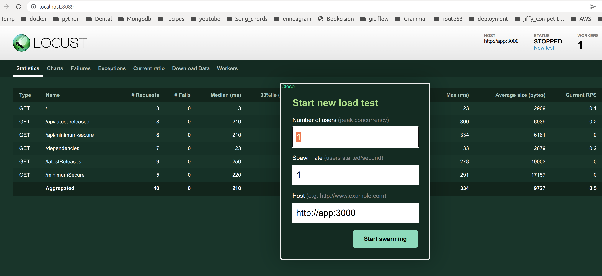

# API with Express & Handlebar Templates [^1]

This is a simple Nodejs application to be deployed on AWS.  

## Background

The solution should:
  - run on AWS's free tier
  - auto-scale with load
  - be fully automated - employ infrastructure as code (IAC)
  - include sample load testing methodology

### Consideration

For infrastructure as code (IAC), the considerations are native AWS developer tools (Boto3, CDK, cloud formation), Pulumi, and Terraform. Terraform was chosen because of the larger community. 

A workflow or pipeline engine is recommended for a singe entry point to launch and destroy the demo. With simple automation, Terraform and Pulumi should suffice.  Some other simple workflows include: Jenkins pipelines with Groovy language, CircleCI pipelines, and AWS Codepipeline.

To autoscale the application, we will depend on the cloud provider.  AWS offers many technologies that include autoscaling groups on Ec2, containers on Fargate, AWS ECS, and lambda functions. Lambda functions was chosen for simplicity and costs. However, environments that standardarize their microservices with containers should strongly consider Fargate or AWS ECS.  Docker provides the best way to package and distribute applications. (portability) 

### Diagram

The diagram shows a simple VPC with a single security group that allows incoming traffic on port 3000.  We leverage API Gateway integration with lambda functions to host the application. AWS lambda is a pay-as-you-go service that autoscales on load.



## Docker Build and Run (Locally)

To build and run the application locally, you must have Docker installed. 
Please connect via browser on http://localhost:80

```
cd lambda
docker build -t nodejs-api-express-example:latest . -f Dockerfile 
docker run --rm -it -p 80:3000 nodejs-api-express-example:latest 
```

## Create Bucket for Lambda Function (Build for AWS)

A bucket is needed to upload the lambda function.  It was chosen to separate the code 
process from the deployed infrastructure. Using Docker, we also gained the benefits 
of code portability.

```
export AWS_ACCESS_KEY_ID=<CHANGEME>
export AWS_SECRET_ACCESS_KEY=<CHANGME>
export AWS_DEFAULT_REGION=<CHANGME>

# need a unique s3 bucket name
export TF_VAR_bucket=nodejs-demo-567901 (some other random suffix)
cd terraform/bucket

terraform init
terraform plan
terraform apply -auto-approve
```

## AWS Lambda Zip Package (Build for AWS)

This step will build, package, and upload the code as a zip package to create
the lambda function. Notably, a lambda handler was added to the code base.  

The lambda handler is: @vendia/serverless-express - 4.8.0.

- build code and create zip package

```
export AWS_ACCESS_KEY_ID=<CHANGEME>
export AWS_SECRET_ACCESS_KEY=<CHANGME>
export AWS_DEFAULT_REGION=<CHANGME>

export LAMBDA_PKG_NAME=nodejs-api-express
export S3_BUCKET=nodejs-demo-567901 
export DOCKER_TEMP_IMAGE=temp-lambda-pkg

cd lambda

# build the container with code
docker build --build-arg pkg_name=$LAMBDA_PKG_NAME \
             --build-arg s3_bucket=$S3_BUCKET \
             -t $DOCKER_TEMP_IMAGE . -f Dockerfile-to-s3
```

- upload code package to s3 bucket

```
export LAMBDA_PKG_DIR=/var/tmp/package/lambda

echo "AWS_ACCESS_KEY_ID=$AWS_ACCESS_KEY_ID" > .env
echo "AWS_SECRET_ACCESS_KEY=$AWS_SECRET_ACCESS_KEY" >> .env
echo "LAMBDA_PKG_NAME=${LAMBDA_PKG_NAME}" >> .env
echo "S3_BUCKET=${S3_BUCKET}" >> .env
echo "DOCKER_TEMP_IMAGE=${DOCKER_TEMP_IMAGE}" >> .env
echo "LAMBDA_PKG_DIR=${LAMBDA_PKG_DIR}" >> .env

cd lambda

docker run --rm -i --env-file .env \
       $DOCKER_TEMP_IMAGE cp \
       ${LAMBDA_PKG_DIR}/${LAMBDA_PKG_NAME}.zip \
       s3://${S3_BUCKET}/${LAMBDA_PKG_NAME}.zip

rm -rf .env
```

## Deploy to AWS

The remaining Terraform modules will create the VPC, Lambda function, and API Gateway.  
The lambda and vpc modules were heavily modified from: 
https://github.com/techjacker/terraform-aws-lambda-api-gateway.  

The API module was created from scratch.

Create a __terraform.tfvars__ file to execute the main Terraform modules.

```
cd terraform/vpc-lambda-apigw

terraform init
terraform plan
terraform apply -auto-approve

```

## Load Test

We use locust for load testing.  To get it up and running alongside the application, we will
run them together with docker-compose.

```
# build local version of app
cd lambda
docker build -t nodejs-api-express-example:latest . -f Dockerfile 

# run the app with locust
cd test
docker-compose up -d
```

- connect to locust on the browser: 
  localhost:8089

- enter the host for locust (e.g. locally would be http://app:3000). 
- enter the parameters and click "Start swarming"



- to modify the load tests, please modify locustfile.py accordingly

- To scale the load tests in a production environment, we can use an autoscaling service like Fargate or Lambda functions to execute the tests.

## Issues

There are couple of issues caused with this approach.  Notably, there is a problem with API routing in the Lambda function. 
The problem seems to reside in the expressjs lambda handler - @vendia/serverless-express. The resolution may involve modifying 
the app to be more lambda friendly or simply using a different lambda handler altogether.

Alternatively, another pseudo free tier solution is using ECS. Autoscaling is builtin ECS. ECS is an AWS only product.

[^1]: [<span style="color:blue"> Original Source </span>](https://github.com/nodejs/examples/tree/main/servers/express/api-with-express-and-handlebars)

